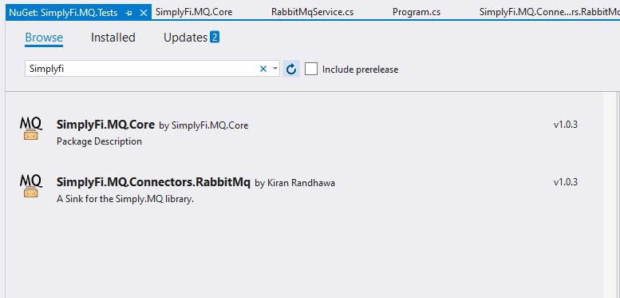

SimplyFi.MQ 
=== 


What is SimplyFi.MQ? 
=== 
Simply put (you see what I did there?) this project provides a convenient attribute approach to message subscription. It's extensible and can support any subscription-based system via the use of connectors. Currently there is only one connector for rabbitMQ. 

Getting Started
=== 

## Step 1 Install the component

Install via the dotnet CLI:

```
dotnet add package SimplyFi.Connectors.RabbitMq
```
OR 

Install via Nuget in Visual Studio

Search for SimplyFi.Connectors.RabbitMq




## Step 2 Instantiate the message broker

Set up your Dependency injection container: 
``` csharp
var services = new ServiceCollection();

services.AddTransient(_ =>
    new RabbitMqConnection("localhost", "user", "password"));

services.AddTransient<IMessageService, RabbitMqService>();
services.AddTransient<IMessageBroker, MessageBroker>();

ServiceProvider = services.BuildServiceProvider();
```

OR 

You can do this without dependency injection like so: 
``` csharp
var messageBroker = new MessageBroker(
            new RabbitMqService(
                new RabbitMqConnection(
                    "localhost", "user", "password")
            ));
```

## Step 3 Create a message class

Create a message class that implements the IMessage interface.

``` csharp
public class ExampleMessage : IMessage
{
    public string Text { get; set; }
}
```

## Step 4 Publishing a message

Using the message broker we can publish a message to bus like so:

``` csharp
messageBroker.Publish("QueueName", new ExampleMessage() 
{ 
    Text = "Some message here." 
});
 ```

After publishing the component will have created the queue if it didn't exist already. 

## Step 5 Subscribe to the message

This is where things get cool 😎. 

You can create a class which implements the ISubscriber interface, then use the Subscribe attribute on a method which takes in your message as a parameter. 

Simplify.MQ will instantiate your class at runtime, listen for messages and automatically run your methods when the appropriate messages are received. 
 
 ``` csharp
public class OrdersService : ISubscriber
{
    [Subscribe(queueName: "QueueName", typeof(ExampleMessage))]
    public void OrderWasCreated(ExampleMessage message)
    {
        Console.WriteLine("Orders service was called.");
        Console.WriteLine(message.Text);
    }
}
```

